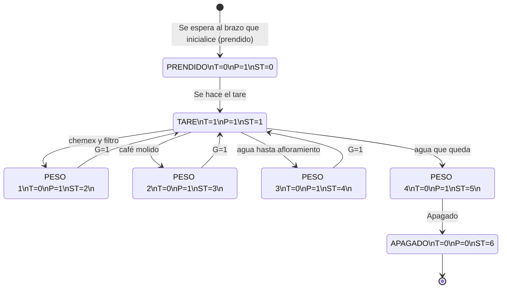

## Finite-state machine - Robotic Arm for Coffee

We are using two scales to measure the weight of both the coffee beans and the water. An Arduino Nano and xArm sends logic signals to control state transitions. 

## Finite-state machine Diagram

## Pinout for Arduino Nano

Wiring for the Arduino Nano is as follows:

| Pin | Function       | Description          |
|-----|----------------|----------------------|
| D4  | scaleCoffee_DOUT_PIN   |          |
| D5  | scaleCoffee_SCK_PIN  |           |
| D8  | scaleChemex_DOUT_PIN    |   |
| D9  | scaleChemex_SCK_PIN  |         |
| D8  | xArm_DOUT_PIN  |         |
| GND | Ground         | Ground connection    |

