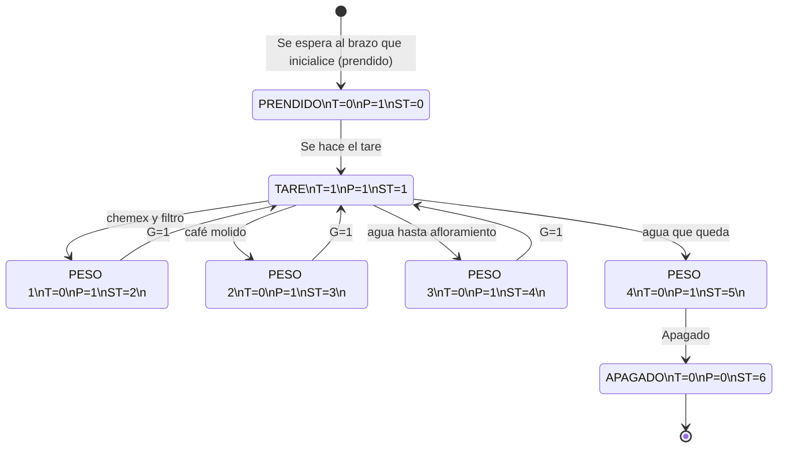

## Finite-state machine - Robotic Arm for Coffee

We are using two scales to measure the weight of both the coffee beans and the water. An Arduino Nano and xArm sends logic signals to control state transitions. 

## Finite-state machine Diagram

## Pinout for Arduino Nano - Finite-state machine

Wiring for the Arduino Nano is as follows:

| Pin | Arduino Nano Function  | Description          | Pin Xarm Connection |
|-----|------------------------|----------------------|---------------------|
| D2  | resetButtonPin         | Reset button input   |                     |
| D3  | tare_DOUT_PIN          | Tare Xarm output     | DO5                 |
| D4  | scaleChemex_DOUT_PIN   | Signal pin 1         |                     |
| D5  | scaleChemex_SCK_PIN    | Clock signal 1       |                     |       
| D6  | dispenser_enabled      | Dispenser enabled    |                     |
| D7  | enable_DOUT_PIN        | Enable Xarm output   | DO4                 |
| D8  | scaleCoffee_DOUT_PIN   | Signal pin 2         |                     |
| D9  | scaleCoffee_SCK_PIN    | Clock signal 2       |                     |
| D10 | pinServo               | Servo control        |                     |
| D11 | messageToggleButtonPin | Message toggle button|                     |
| D12 | weigth_DIN_PIN         | Weight Xarm input    | DI1                 |
| A1  | potPin                 | Potentiometer input  |                     |
| GND | Ground                 | Common ground        | GND                 |

## Pinout for Arduino Nano - Dispensador de café

Wiring for the Arduino Nano is as follows:

| Pin | Arduino Nano Function | Description                  | Pin Connection SM    |
|-----|-----------------------|------------------------------|----------------------|
| D2  | interruptPin          | Enable pin from state machine|         ??¿¿         |
| D3  | PWMA                  | Motor speed control          |                      |
| D5  | pinServo1             | Servo control pin            |                      |
| D10 | AIN1                  | Motor direction control 1    |                      |
| D11 | AIN2                  | Motor direction control 2    |                      |

## PCB Schematic - Cafetero

**
| A2  | potentiometer         | Potentiometer input          |                      |
| GND | Ground                | Common ground                |             GND      |
